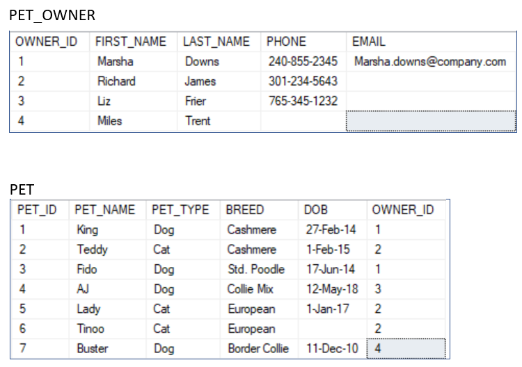
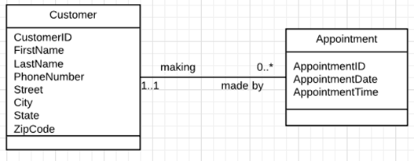

# **Structuring Data**

## **Introductie**

Tot zover heb je vooral gewerkt met data input/output via de terminal of een text-bestand. Maar echte back-end projecten hebben hier natuurlijk een heel belangrijk apart onderdeel - de database!

Databases draaien meestal op dezelfde computer als je back-end programma, maar wel in een heel ander programma / andere omgeving. Ook zijn er heel veel verschillende soorten databases - allemaal met hun eigen voordelen / nadelen.

In deze handout gaan we 3 verschillende soorten databases onderzoeken. Ook gaan we veel leren over de meest gebruikte vorm van databases - de Relational Database. Ook gaan we kijken hoe je een schets maakt van zo’n database.

Databases zijn vaak erg “low-level” omdat ze vanuit een terminal (zonder programma) opgezet moeten kunnen worden. Dat kan het lastig maken om ermee te werken - als je een klein foutje intypt gebeurt er al snel iets verkeerds met je data!

Gelukkig zijn er veel tools die je daarmee kunnen helpen.

# **Inhoud**

1. Types of databases
    * Memory Databases
    * Key/Value & Document Databases
    * Relational Databases
2. Relational Database Design
    * Relationships & Keys
    * Schemas & Diagrams
3. Creating & Maintaining Databases
4. Opdrachten

# **Types of Databases**

Databases zijn er dus in veel verschillende soorten en maten. Dat betekent niet dat ze allemaal even belangrijk zijn! Sommige soorten worden heel veel meer gebruikt dan anderen.

Toch is het een goed idee om een overzicht te hebben van de verschillende soorten, en waar ze voor gemaakt zijn. De goede soort database gebruiken kan een grote impact hebben op de performance van je applicatie!

Er zijn veel verschillende soorten, maar wij gaan de 3 meest gebruikte onderzoeken - **Key/Value**, **Document** en **Relational** databases. Relational databases zijn verreweg de bekendste hierbij - daarom hoor je soms ook wel eens de term _Relational_ en _Non-Relational_ Databases.

Daarnaast is er nog 1 ander belangrijk onderscheid dat je moet begrijpen - waar de data fysiek wordt opgeslagen. Daarmee bedoelen we niet in welke kamer de server staat, maar op welk onderdeel van de computer de database draait.

## **Memory Databases**

Meeste databases slaan hun data op in de harde schijf van je computer - maar niet allemaal! Er is namelijk ook een categorie **_In-Memory Databases_**. Deze slaan de data dus op in het computergeheugen (RAM) ipv de harde schijf. Dit heeft een aantal gevolgen:

* Computergeheugen wordt **niet bewaard** als de computer uit staat
* Computergeheugen is **_veel minder groot_** qua ruimte dan de harde schijf
* Computergeheugen is **_heel veel sneller_** te bereiken dan de harde schijf

Meestal wordt zo’n In-Memory Database dus niet alleen gebruikt, maar als een soort extra laag bovenop een bestaande database. Als er bepaalde data is waar veel om gevraagd wordt, kan het op deze manier veel sneller gegeven worden!

Memory databases zijn er in verschillende vormen - zo kan een In-Memory Database nog steeds een Key/Value, Document of Relational database architectuur hebben.

Voor dit soort databases worden vaak aparte tools gebruikt. Meestal hebben deze tools ook een onderdeel waarmee je een “normale” database kan opzetten. Veelgebruikte programma’s hiervoor zijn **_Redis_** en **_H2 Database_**

## **Key/Value & Document Databases**

Dit zijn allebei vormen van **_non-relational / NoSQL_** databases. Ze lijken erg veel op elkaar en worden daarom ook vaak met elkaar verward. Toch zijn ze niet hetzelfde - je kan een Key/Value database zien als de “simpele versie” van een Document database.

### **Key/Value Database**

Een key/value database is eigenlijk te vergelijken met een heel grote Map, of een JSON object. De enige manier om data op te halen is via de key - een string waarde. De value kan veel verschillende dingen zijn - een getal, een string, een Object of iets anders. 

Key/Value databases zijn heel snel in het lezen/schrijven van data, maar geven verder heel weinig hulp Je kan alleen operaties uitvoeren via de key - wat er in elke aparte value zit is niet relevant, want je kan er toch nooit op sorteren / zoeken.

Technisch gezien is _Redis_ niet alleen een key/value database, maar dat is wel waar het hoofdzakelijk voor wordt gebruikt.

### **Document Database**

Daarnaast heb je dus ook de Document Database. Deze heeft nog steeds een heel vergelijkbare architectuur - allemaal keys/value pairs die lijken op een heel groot JSON Object.

Het verschil is dat een Document Database kennis heeft van de values die erin opgeslagen worden. Het kan deze values gebruiken om je zoekresultaten te sorteren, om alleen een gedeelte van de value te selecteren, of zelfs om een resultaat in de database te vinden waar je de key niet van kent!

Een document database is een heel goede “all-round” keuze. Het leest ook heel snel data, maar het schrijven / updaten van data is wel wat langzamer dan bij een Key/Value database. Daarnaast is het ook langs niet zo ingewikkeld om op te zetten als een Relational Database, en je hoeft niet heel veel van tevoren na te denken hoe je data eruit ziet qua structuur.

De meest gebruikte Document database is **_MongoDB_**.

## **Relational Databases**

Relationele databases zijn verreweg de bekendste en meest gebruikte soort database. Helaas is deze soort ook een stuk ingewikkelder dan de soorten die we hiervoor hebben behandeld.

Zoals de naam al aangeeft gaat een Relationele Database heel veel over de relaties tussen je verschillende soorten data. Dit is vergelijkbaar met de relaties tussen verschillende Classes / Objecten zoals je die in een Class Diagram kan weergeven. Bij een relationele database is deze structuur dus ontzettend belangrijk!

Dit soort databases zijn al sinds de jaren 80 de standaard. Het heeft ook een eigen taal die bij (bijna) alle relationele databases gebruikt wordt om data uit te lezen. Deze taal is **_SQL - Structured Query Language_**. Waarschijnlijk heb je hier al eens van gehoord.

Om het extra verwarrend te maken, worden er bij vaak verschillende termen gebruikt met dezelfde betekenis. We gaan deze kort benoemen om dit wat te verduidelijken. Meestal zie je de SQL termen gebruikt worden, dus daar leiden we mee - de termen tussen haakjes is hoe het soms ook anders genoemd wordt in “Database Theorie”. 

We gebruiken het onderstaande als voorbeeld:

Hier zie je 2 tabellen die een duidelijke relatie hebben - we gaan eerst even de termen langs die je bij zo’n tabel tegen kan komen. In principe hoef je alleen de eerste (SQL) termen te onthouden:

* **_Rows_** (ook wel **_Tuple / Record_** genoemd)
    * Een row is een rij in de tabel. Elk item in een bepaalde tabel heeft een eigen rij.
* **_Columns_** (ook wel **_Attribute / Field_** genoemd)
    * Elke column heeft een waarde die bij de items aanwezig kunnen zijn.
* **_Table_** (ook wel **_Relation / Base relvar_** genoemd) 
    * Een tabel is een verzameling gerelateerde items - items die met dezelfde attributen.
* **_View / Result Set / Query_** (ook wel **_Derived relvar_** genoemd)
    * Deze is wat minder vanzelfsprekend. Dit is het resultaat van een zoekopdracht binnen een database - bijvoorbeeld alle Pets waar OWNER_ID gelijk is aan een bepaald getal.
    * Een view kan ook meerdere tabellen combineren, bijvoorbeeld alle PETS gecombineerd met diens OWNER op basis van de OWNER_ID

Zo’n **_Result Set_** wordt dus gecreëerd met SQL. Maar voordat je data kan zoeken of invoeren in een database moet je van tevoren bepalen hoe deze eruit ziet! Dat gaan we dus eerst onderzoeken.

# **Relational Database Design**

De structuur van Relational databases is dus ontzettend belangrijk. Deze moet dan ook bepaald worden voordat je de database gaat gebruiken!

Die voorbedachte structuur wordt ook wel een **_schema_** genoemd. Zo’n schema kan je schetsen in een diagram, net als bij UML! Technisch gezien is het dan geen UML, maar het wordt vaak alsnog in die notatie geschreven. Zo’n diagram van een Relational Database heet ook wel een **_Entity-Relationship Diagram_**.

Maar hoe bepaal je überhaupt welke tabellen en relaties er in een database horen? Dat gaan we eerst even onderzoeken.

## **Relationships & Keys**

Een tabel met rijen aan data **moet** een manier hebben om deze data van elkaar te onderscheiden. Meestal gebruik je hiervoor een soort ID - dat heb je in het voorbeeld eerder ook gezien.

Zo’n unieke waarde heet bij Relational Databases een **_Primary Key_**. Toch is niet elke unieke waarde gelijk een zo’n Key;

* Elke tabel heeft maar 1 Primary Key
* Een Primary Key kan **nooit** leeg (NULL) zijn!
* Een Primary Key kan **nooit** veranderd worden!

Soms zijn er ook meerdere mogelijke Primary Keys. Denk aan een een tabel van studenten die zowel een STUDENT_ID als een BURGER_SERVICE_NUMMER bijhoudt. Dat zijn beide unieke waardes die elke Student heeft, en nooit veranderd worden. Het zijn dan allebei **_Candidate Keys_**. Uiteindelijk moet de ontwerper van de database bepalen welke Candidate Key daadwerkelijk de Primary Key wordt.

Een school die 20 miljoen jaar bestaat kan misschien problemen krijgen met unieke STUDENT_ID waardes - ze worden steeds langer en langer. Daarom besluit de school om over te gaan op een nieuwe database waarbij de STUDENT_ID waardes alleen uniek zijn per schooljaar! Hoe kan er dan nog een Primary Key gebruikt worden?

Dit komt niet heel vaak voor, maar **_een Primary Key kan ook een combinatie van meerdere attributen zijn_**. In dit voorbeeld is STUDENT_ID + YEAR_ENROLLED een combinatie die nog steeds altijd uniek is! Zo’n gecombineerde key heet ook wel een **_Composite Key_**.

Primary Keys zijn dus heel belangrijk - elke tabel moet er een hebben! Maar ze zijn niet alleen belangrijk voor een tabel zelf. Om dat te demonstreren gaan we nog even terug naar het voorbeeld van eerder:

Hier kan je zien dat de tabel PET_OWNER een Primary Key heeft - OWNER_ID. Maar deze Primary Key wordt ook gebruikt in de tabel PET!

Met de verwijzing naar een Primary Key uit een andere tabel wordt de relatie tussen die tabellen duidelijk gemaakt. Als er in een bepaalde tabel zo’n Key wordt gebruikt, heet dat daar een **_Foreign Key_**.

De tabel PET heeft dus een Primary Key (PET_ID) EN een Foreign Key (OWNER_ID)! Daar staat tegenover dat PET_OWNER geen Foreign Key heeft - deze zijn dus **niet** verplicht!

Deze Foreign Keys zijn dus ontzettend belangrijk in het bepalen van de relaties tussen je verschillende tabellen. Maar het is makkelijk om hierin door te schieten en je data teveel op te splitsen.

Om je daarvoor te behoeden kan je dan weer de Primary Key gebruiken - als je merkt dat 2 van je tabellen precies dezelfde Primary Key gebruiken, dan hoort het dus eigenlijk 1 tabel te zijn!

## **Schemas & Diagrams**

Al deze theorie over Keys is behoorlijk plat - en platte tekst is heel lastig om van te leren! Daarom zijn **_Entity-Relationship Diagrams (ERDs)_** bedacht - om te helpen bij het visualiseren van hele droge data.

ERDs hebben een eigen officiële notatie, maar die wordt niet altijd gebruikt. Soms zie je namelijk ook een Class Diagram / UML notatie staan! Ze lijken dan ook vrij veel op elkaar.

Het grote verschil zit dan ook in de onderdelen die we in het vorige gedeelte hebben behandeld: de relaties en de keys. Bij Class Diagrams heb je misschien al eens getallen naast de lijnen tussen classes zien staan:

Met wat ervaring kan je hieruit opmaken dat elke Customer “0 tot meerdere” Appointments kan hebben, en dat elke Appointment bij precies 1 Customer moet horen. Het lijkt ook vrij vanzelfsprekend dat _CustomerID_ en _AppointmentID_ de Primary Keys van deze tabellen zouden zijn!

Toch is dit niet helemaal ideaal - daarom zijn ERDs dus bedacht. Kijk eerst [dit filmpje](https://www.youtube.com/watch?v=QpdhBUYk7Kk) en vervolgens [het vervolgfilmpje](https://www.youtube.com/watch?v=-CuY5ADwn24). Lees je liever? Dan is [hier](https://www.lucidchart.com/pages/nl/erd-symbolen-en-notatie) een heel compleet artikel.

Zorg dat je alle 6 verschillende soorten Cardinality kent. Teken vervolgens een simpel ERD van de tabellen PET en PET_OWNER.

# **Creating & Maintaining Databases**

SQL is een vrij lastige taal - er zitten veel kanten aan die weinig gebruikt worden, en al deze dingen leren kost veel tijd. Daarnaast zijn er ook heel veel manieren om SQL te gebruiken - pure SQL wordt eigenlijk nauwelijks geschreven!

Toch is het heel belangrijk om een fundamentele kennis te hebben van de SQL code die je wel veel ziet - daar gaan we in dit onderdeel mee oefenen. Later ga je dan verder leren hoe je via Java automatisch geschreven SQL kan gebruiken.

Ook gaan we kijken naar een programma waarmee je je eigen SQL database op kan zetten. Zo’n programma heet ook wel **_DataBase Management System - DBMS_**. Voor Relational Databases zie je ook vaak de term **_RDBMS_** gebruikt worden.

Omdat SQL al zo oud is, zijn er heel veel programma’s die hiermee werken. Je hebt betaalde programma’s van o.a. Microsoft en Oracle, maar er zijn ook heel bekende open-source opties! De bekendste hiervan zijn **_PostgreSQL_** en **_MySQL_** - die laatste is degene die we willen dat jij gebruikt.

SQL is ontzettend veelzijdig en complex - je kan het vergelijken met het leren van een heel nieuwe programmeertaal! 

De beste uitleg die wij aanraden is de [Programming with Mosh Tutorial](https://www.youtube.com/watch?v=7S_tz1z_5bA) over SQL en MySQL. Dit is een vrije lange video tutorial met oefen-opdrachten ertussenin, en een set aan oefen-data erbij geleverd.

De oefeningen in die tutorial gaan we ook gebruiken bij de opdrachten verderop. Volg je toch liever een andere tutorial / manier om te leren? Dan geven we je nog het volgend mee:

**Zorg ervoor dat je in ieder geval de volgende delen van MySQL installeert**:

* MySQL Workbench (hiermee maak je een database)
* MySQL Server (hiermee draai je een database)
* Connector/J (hiermee kan je een database met Java verbinden)

Geschreven uitleg / referenties over SQL:

* [w3schools](https://www.w3schools.com/sql/default.asp)
* [tutorialspoint](https://www.tutorialspoint.com/sql/index.htm)

Andere video tutorials die je misschien interessant vindt:

* [Web Dev Simplified Tutorial](https://www.youtube.com/watch?v=p3qvj9hO_Bo)
* [freeCodeCamp Tutorial](https://www.youtube.com/watch?v=HXV3zeQKqGY)

# **Opdrachten**

De essentie van werken met een database zijn de zogeheten **_CRUD Operations - Create, Read, Update en Delete_**. Niet al deze operaties zijn even makkelijk of even veel gebruikt - daarom zullen we een stuk langer besteden aan het uitlezen van data dan aan de rest.

De dataset die we bij deze opdrachten gaan gebruiken kan je [hier](https://bit.ly/3rvtqdO) vinden. Zorg dat je “create-databases.sql” opent in MySQL Workbench. Kijk het gerust even door, en laat het vervolgens uitvoeren om de databases op jouw computer aan te maken.

De opdrachten kan je in aparte .txt en .SQL bestanden opslaan in je repo.

## **Reading Data**

Je kan via SELECT, FROM en WHERE data uit tabellen uitlezen en benoemen. De data die je te zien krijgt kan je ook nog aanpassen. Dit verandert niet de data in de database zelf - alleen het resultaat wat je te zien krijgt!

Deze veranderingen kan je ook meerdere tegelijk toepassen! De volgorde maakt hierbij natuurlijk veel uit.

De Sauce - Ranch Dressing uit deze dataset heeft een unit_price van 1.63. Helaas is de plastic-belasting van 30 cent hier nog niet bij opgeteld. Daarnaast kost het volgende week 50% minder, maar die plasticbelasting wordt daar niet in meegerekend!

### **Opdracht1.1**

Selecteer de correcte bonusprijs van de Ranch Dressing. Gebruik de product_id in de WHERE clause.

### **Opdracht1.2**

Wat is de standaard volgorde van de AND en OR operators? Hoe pas je deze aan?

Soms kan je via dit soort operaties dus ook informatie combineren. Als je deze informatie wil labelen kan je het een alias geven.

### **Opdracht1.3**

Selecteer uit order_items de totale prijs van order #6 waarvan de totale prijs meer dan 30 is. Benoem deze total_price in je SELECT statement.

Je kan ook IN of BETWEEN gebruiken om de syntax van je WHERE conditie wat netter / korter te maken.

### **Opdracht1.4**

Is “BETWEEN 1000 AND 2000” inclusief de waardes 1000 en 2000?

Je kan via LIKE en REGEXP ook data zoeken die deels een match is. Zoals je misschien al verwacht kan de REGEXP operator wat meer, maar is deze ook wat lastiger.

### **Opdracht1.5**

Selecteer in 4 aparte queries customers met de volgende voorwaarden:

first_name is ELKA of AMBUR

last_name eindigt met EY of ON

last_name begint met MY of bevat SE

last_name bevat B gevolgd door een van R of U

Je kan ook LIMIT en ORDER BY gebruiken om te zorgen dat je grote datasets een beetje filtert. Let hierbij goed op de volgorde! LIMIT gevolgd door ORDER BY heeft een heel ander effect dan andersom.

### **Opdracht1.6**

Selecteer de duurste 3 products via de unit_price

## **Combining Data**

Tot zover heb je alleen data uit enkele tabellen uitgelezen. Maar vaak wil je data uit meerdere tabellen combineren! Dit doe je via een zogeheten JOIN. Zo’n JOIN heb je in 2 soorten - de INNER JOIN en de OUTER JOIN.

Meestal (en ook bij MySQL) is er zoiets als een **_implicit inner join syntax_**. Dat houdt in dat je bij een INNER JOIN het woordje INNER weg kan laten - als je alleen JOIN ziet staan is het dus een INNER JOIN.

Bij een JOIN waarmee je de tabellen aan elkaar wil koppelen. Meestal is dit via een foreign of primary key - bijvoorbeeld: 

SELECT * FROM orders

JOIN products ON orders.product_id = products.product_id

Je kan ook via een alias products en orders wat korter maken. Dit is handig als je bijvoorbeeld kolommen wil selecteren die in beide tabellen aanwezig zijn - het maakt je code wat schoner.

### **Opdracht2.1**

Vul de bovenstaande JOIN aan met een alias voor products en orders.

Als je specifieke kolommen selecteert, is het niet altijd verplicht de naam van de tabel ervoor te zetten. Toch is dit wel aan te raden om verwarring te voorkomen.

Een situatie waar dit WEL altijd moet, is de zogeheten SELF JOIN. Hierbij combineer je een set van data met een andere set data uit dezelfde tabel.

### **Opdracht2.2**

Selecteer uit sql_hr.employees alle employees, en voeg de naam van de manager van elke employee eraan toe.

Je kan ook data uit meer dan 2 kolommen met elkaar combineren - dan moet je meerdere JOIN statements achter elkaar zetten. Je kan zelfs meerdere kolommen selecteren om op te JOINen! Dit is handig bij composite keys - waar de primary key uit meerdere velden bestaat. Een voorbeeld hiervan kan je zien in de sql_store.order_items tabel.

Veel belangrijker dan de bovenstaande opties is de eerder benoemde OUTER JOIN. Hiermee krijg je alle data uit een van de 2 tabellen, zelfs als er geen “passende” kolom in de andere tabel zit!

Maar welke van de 2 tabellen krijg je dan alle data voor? Dat hangt af van de volgorde en de soort OUTER JOIN die je gebruikt. Je hebt namelijk een LEFT OUTER JOIN en de RIGHT OUTER JOIN!

We gaan dit zelf even onderzoeken. Begin met de volgende statement:

SELECT *

FROM shippers s

JOIN orders o ON o.shipper_id = s.shipper_id

### **Opdracht2.3**

1. Vervang de bovenstaande door een LEFT JOIN en voer het uit.
2. Vervang het vervolgens met een RIGHT JOIN en voer het weer uit
3. Schrijf het nu zo, dat je hetzelfde resultaat bereikt met de LEFT JOIN als je net met de RIGHT JOIN hebt gedaan.

Zo merk je dat de volgorde dus uitmaakt bij een LEFT of RIGHT JOIN, en dat met beiden dezelfde resultaten kan behalen. Daarom is het aan te raden om altijd LEFT JOIN te gebruiken - dan maak je het minder verwarrend om je SQL code te lezen!

Er zijn ook nog 2 “trucjes” die je kan gebruiken om je JOINs wat schoner te maken. Zo kan je via USING join condition die verkorten, en via een NATURAL JOIN kan je die zelfs weglaten!

### **Opdracht2.4**

1. Herschrijf de vorige opdracht met USING
2. Doe nu hetzelfde met een NATURAL JOIN. Kan je bedenken waarom dit af te raden is?
3. Probeer nu de JOIN condition helemaal weg te laten. Wat gebeurt er?

Wat je net hebt gemaakt is een zogeheten CROSS JOIN. Meestal is dit af te raden - let daarom goed op dat je de JOIN condition niet vergeet! Wil dit toch doen? Schrijf het dan expliciet uit met CROSS JOIN ipv JOIN.

Er is nog 1 laatste manier om geselecteede data te combineren: de UNION operator. Waar je bij een JOIN data “horizontaal” naast elkaar combineert, doe je dat met een UNION “verticaal” - onder elkaar.

### **Opdracht2.5** 

1. Schrijf een query die alle customers met birth_date &lt; 1975-01-01 selecteert. Geef deze resultset een extra kolom status met waarde “Old”.
2. Doe nu hetzelfde voor alle customers met birth_date > 1990-01-01 en geef deze een kolom status met waarde “Young”
3. Gebruik de UNION operator om deze samen te voegen
4. Probeer nu de overige customers te selecteren en via de UNION aan je resultset toe te voegen. Waarom kan dit niet?

## **SQL Data Types**

Je hebt inmiddels gemerkt dat dates in SQL altijd als YYYY-MM-DD geschreven worden. SQL heeft zijn eigen datatypes waar date dus eentje van is. Er zijn erg veel verschillende - het is bij een database natuurlijk ontzettend belangrijk om zo precies mogelijk te zijn! [Hier](https://www.w3schools.com/sql/sql_datatypes.asp) kan je een lijst met alle MySQL Data Types vinden.

Allemaal leren is vrij overbodig - ze zijn lang niet allemaal echt veel gebruikt. Natuurlijk zijn er een aantal die wel veel gebruikt worden - daatom willen we graag dat je de volgende even extra onderzoekt:

* char
* varchar
* nvarchar
* int
* decimal
* bit
* date

### **Opdracht3.1**

1. Wat is het verschil tussen char en varchar?
2. Wat is het verschil tussen varchar en nvarchar?

Je ziet vaak een getal in haakjes gebruikt worden na het datatype, bijv. int(10) of varchar(50).

3. Bij varchar en int doet dit getal niet precies hetzelfde. Wat is het verschil?

Je kan de datatypes die een tabel in MySQL gebruikt ook bekijken via rightclick > Alter Table of hover > middelste icoontje

### **Opdracht3.2**

Wat betekenen PK, NN, UN, AI en Default/Expression in dit overzicht?

## **Inserting, Updating and Deleting Data**

Het aanmaken, veranderen of deleten van data volgt vrij vergelijkbare regels. 

Je hebt hiervoor geleerd dat Auto Increment ervoor zorgt dat MySQL automatisch bepaalde waardes aanmaakt. Nu gaan we dit even testen:

### **Opdracht4.1**

1. Gebruik INSERT INTO orders VALUES om een order toe te voegen aan je tabel. Geef voor deze values een waarde mee voor customer_id, order_date en comments. Gebruik de DEFAULT waarde voor status.
2. Gebruik nu DELETE FROM orders WHERE om je net toegevoegde order te verwijderen. **Let goed op dat je de WHERE niet vergeet, anders delete je alle data in de tabel!**
3. Maak vervolgens nogmaals precies dezelfde order aan. Welke waarde staat er nu in order_id bij je toegevoegde item?
4. Gebruik nu UPDATE orders SET customer_id = &lt;value> WHERE customer_id = &lt;andere value> om deze waarde te veranderen.

Je kan ook meerdere waardes inserten door de rows in parentheses te zetten.

Iets wat ook veel gebruikt wordt bij het aanmaken/updaten/deleten van items is een zogeheten **_Subquery_**. Hierbij kan je de view/resultset van een query gebruiken als conditie voor een andere query!

### **Opdracht4.2**

Maak een nieuwe tabel invoices_archive. Gebruik hierin de invoices, maar vervang de client_id door de naam van de client. Zorg ervoor dat alleen de invoices met een payment_date in de invoices_archive tabel worden opgeslagen!

Als je dit allemaal hebt gedaan heb je een redelijk goed begrip van de basis van SQL. Er is natuurlijk nog genoeg meer om over te leren - Stored Procedures en Functions bijvoorbeeld! 

De kans dat je dit nodig hebt is niet heel erg groot, en daarom slaan wij het over. Meeste databases worden namelijk niet direct via SQL aangepast. Dit gaat via een tool die code uit een bepaalde programmeertaal vertaalt naar SQL! Daarover leer je meer in de volgende handout.
