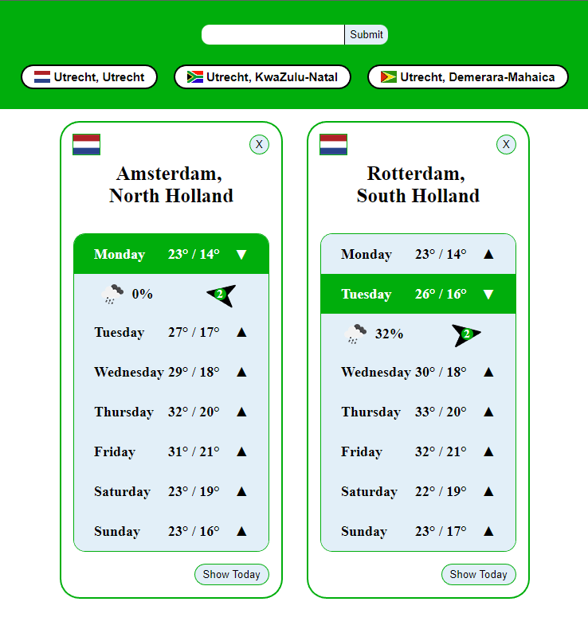
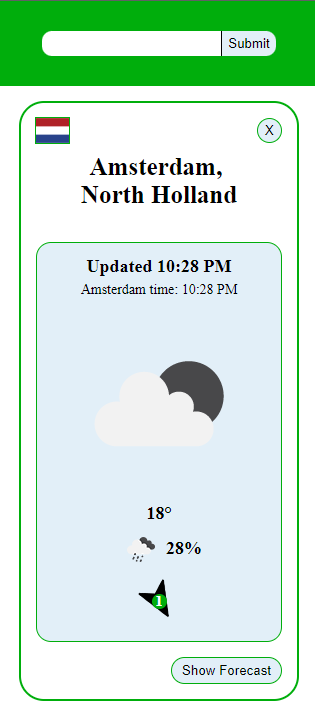

# **React WeatherApp**

Voor deze opdracht ga je met React een WeatherApp maken. Deze app gebruikt echte data van OpenWeatherMap. Hoe je app er precies uit ziet mag je helemaal zelf bepalen, maar aan de data die we erop terug kunnen vinden zitten wel wat vereisten!

Ga naar [https://openweathermap.org/api](https://openweathermap.org/api) en maak een account aan. Je krijgt een email met een API key. Met deze API Key kan je vervolgens API endpoints aanroepen. Neem de tijd om de documentatie van de Weather API door te nemen. Voor deze opdracht ga je specifiek aan de slag met de volgende API endpoints:

* [Geocoding](https://openweathermap.org/api/geocoding-api)
* [One Call](https://openweathermap.org/api/one-call-api)

**Let op!** De One Call v3.0 is helaas alleen betaald. Hier gelinkt is de oude versie (1.0) die **wel** gratis is en nog steeds werkt.

Je kan ook de endpoints testen zonder React / de browser, via speciaal daarvoor ontwikkelde tools. Een zo’n tool die wij aanraden is **Postman**. Dit is een complexe applicatie die je kan downloaden, maar die je ook in de browser kan draaien!

## **Wat ga je leren?**

* Je gaat leren hoe je de documentatie van een API leest.
* Je gaat leren hoe REST API endpoints samen gebruikt worden
* Je gaat leren hoe fetch API in React gebruikt kan worden.
* Je gaat oefenen met de structuur van componenten en state in React.

## **Wat moet je bouwen?**

De app moet voldoen aan de volgende eisen:

* Je moet een plaats kunnen invullen en de weersvoorspelling daarvan kunnen zien.
* Bij deze weersvoorspelling moet zowel de data van vandaag als de data van de komende week te zien zijn.
* De temperatuur moet in celsius zijn.
* Je applicatie moet goed responsive zijn.

## **Voorbeeld Desktop**

## **Voorbeeld Mobiel**

